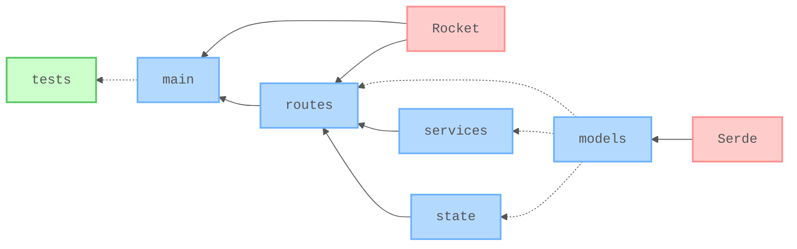

# 🧪 RESTful API with Rust and Rocket

[](https://github.com/nanotaboada/rust-samples-rocket-restful/actions/workflows/rust-ci.yml)
[](https://opensource.org/licenses/MIT)


Proof of Concept for a RESTful API built with [Rust](https://www.rust-lang.org/) and [Rocket](https://rocket.rs/). Manage football player data with SQLite persistence and thread-safe access via Mutex.

## Table of Contents

- [Features](#features)
- [Tech Stack](#tech-stack)
- [Project Structure](#project-structure)
- [Architecture](#architecture)
- [API Reference](#api-reference)
- [Prerequisites](#prerequisites)
- [Quick Start](#quick-start)
- [Containers](#containers)
- [Releases](#releases)
- [Testing](#testing)
- [Command Summary](#command-summary)
- [Contributing](#contributing)
- [Legal](#legal)

## Features

- 🔌 **RESTful CRUD operations** for football player data
- 🩺 **Health check endpoint** for monitoring
- 🔒 **Thread-safe state management** with Mutex-wrapped SQLite connection
- ✅ **Type-safe request/response models**
- 🎯 **Squad number uniqueness validation**
- 📦 **Modular architecture** with clear separation of concerns

## Tech Stack

| Category | Technology |
| -------- | ---------- |
| **Language** | [Rust 2024 Edition](https://www.rust-lang.org/) |
| **Web Framework** | [Rocket 0.5.1](https://rocket.rs/) |
| **Serialization** | [Serde](https://serde.rs/) |
| **Unique IDs** | [uuid](https://github.com/uuid-rs/uuid) |
| **Database** | [SQLite](https://www.sqlite.org/) via [rusqlite](https://github.com/rusqlite/rusqlite) (bundled) |

## Project Structure

```tree
/
├── src/
│   ├── main.rs                      # Application entry point
│   ├── models/
│   │   ├── mod.rs                   # Module exports
│   │   └── player.rs                # PlayerRequest, PlayerResponse structs
│   ├── routes/
│   │   ├── mod.rs                   # Module exports
│   │   ├── health.rs                # Health check endpoint handler
│   │   └── players.rs               # Player CRUD route handlers
│   ├── services/
│   │   ├── mod.rs                   # Module exports
│   │   └── player_service.rs        # Business logic (CRUD operations, validation)
│   └── state/
│       ├── mod.rs                   # Module exports
│       └── player_collection.rs     # Thread-safe state (Mutex<Connection>), DB init and seed
├── storage/
│   └── players-sqlite3.db           # Pre-seeded SQLite database (26 players, committed)
├── Cargo.toml                       # Rust dependencies
└── rust-toolchain.toml              # Rust version configuration
```

### Module Responsibilities

| Module | Responsibility |
| ------ | -------------- |
| **models** | Data structures for the player domain (PlayerRequest, PlayerResponse) |
| **state** | Thread-safe SQLite connection management (`Mutex<Connection>`), database initialization and seed |
| **services** | Pure business logic functions for CRUD operations, validation, and ID generation |
| **routes** | HTTP endpoint handlers that delegate to services and handle HTTP concerns (status codes, JSON) |
| **main.rs** | Application initialization, route mounting, and data loading |

## Architecture

Layered architecture with Rocket's managed state for thread-safe dependency sharing.



*Simplified, conceptual view — not all components or dependencies are shown.*

### Arrow Semantics

Arrows follow the wiring direction: `A --> B` means A is provided to B. Solid arrows (`-->`) represent active dependencies — modules explicitly wired in `main` and invoked at runtime. Dotted arrows (`-.->`) represent structural dependencies — the consumer references types without invoking runtime behavior.

### Composition Root Pattern

`main` is the composition root: it builds the Rocket instance, opens the pre-seeded SQLite database, registers `PlayerCollection` as managed state via `.manage()`, and mounts all route handlers.

### Layered Architecture

Four layers: Initialization (`main`), HTTP (`routes`), Business (`services`), and Data (`state`).

`models` is a cross-cutting type concern — data structures for the player domain (`PlayerRequest`, `PlayerResponse`) consumed across multiple layers, with no business logic of its own.

### Color Coding

Blue = core application modules, red = third-party crates.

## API Reference

### Endpoints

| Method | Path | Description |
| ------ | ---- | ----------- |
| `GET` | `/health` | Health check |
| `GET` | `/players` | List all players |
| `GET` | `/players/:id` | Get player by UUID (surrogate key) |
| `GET` | `/players/squadnumber/:squadnumber` | Get player by squad number |
| `POST` | `/players` | Create new player |
| `PUT` | `/players/squadnumber/:squadnumber` | Update player |
| `DELETE` | `/players/squadnumber/:squadnumber` | Remove player |

### Response Codes

| Code | Description |
| ---- | ----------- |
| `200 OK` | Successful GET/PUT |
| `201 Created` | Successful POST |
| `204 No Content` | Successful DELETE |
| `404 Not Found` | Player not found |
| `409 Conflict` | Duplicate squad number on `POST` |

## Prerequisites

Before you begin, ensure you have the following installed:

- **Rust 2024 Edition or higher** (managed via `rust-toolchain.toml`)
- **Cargo** (comes with Rust)

## Quick Start

### Clone the repository

```bash
git clone https://github.com/nanotaboada/rust-samples-rocket-restful.git
cd rust-samples-rocket-restful
```

### Install dependencies

```bash
cargo build
```

### Start the development server

```bash
cargo run
```

The server will start on `http://localhost:9000`.

### Access the application

- **API:** `http://localhost:9000`
- **Health Check:** `http://localhost:9000/health`

### Test the API

```bash
# Get all players
curl http://localhost:9000/players

# Get player by UUID (Lionel Messi)
curl http://localhost:9000/players/acc433bf-d505-51fe-831e-45eb44c4d43c

# Get player by squad number
curl http://localhost:9000/players/squadnumber/10

# Create a new player (Giovani Lo Celso — squad 27)
curl -X POST http://localhost:9000/players \
  -H "Content-Type: application/json" \
  -d '{
    "firstName": "Giovani",
    "middleName": "",
    "lastName": "Lo Celso",
    "dateOfBirth": "1996-07-09T00:00:00.000Z",
    "squadNumber": 27,
    "position": "Central Midfield",
    "abbrPosition": "CM",
    "team": "Real Betis Balompié",
    "league": "La Liga",
    "starting11": false
  }'

# Update a player (squad number is immutable — used as lookup key)
curl -X PUT http://localhost:9000/players/squadnumber/23 \
  -H "Content-Type: application/json" \
  -d '{
    "firstName": "Emiliano",
    "middleName": "",
    "lastName": "Martínez",
    "dateOfBirth": "1992-09-02T00:00:00.000Z",
    "squadNumber": 23,
    "position": "Goalkeeper",
    "abbrPosition": "GK",
    "team": "Aston Villa FC",
    "league": "Premier League",
    "starting11": true
  }'

# Delete a player (requires Create to have been run first)
curl -X DELETE http://localhost:9000/players/squadnumber/27
```

## Containers

### Build and start

```bash
docker compose up --build
```

The API will be available at `http://localhost:9000`. On first start the entrypoint script seeds the SQLite database into a named volume (`rust-samples-rocket-restful_storage`); subsequent starts reuse the existing data.

### Stop and remove containers

```bash
docker compose down
```

### Remove containers and volume

```bash
docker compose down --volumes
```

## Releases

This project uses Ballon d'Or nominees as release codenames 🏅, inspired by Ubuntu, Android, and macOS naming conventions.

### Release Naming Convention

Releases follow the pattern: `v{SEMVER}-{NOMINEE}` (e.g., `v1.0.0-benzema`)

- **Semantic Version**: Standard versioning (MAJOR.MINOR.PATCH)
- **Nominee Name**: Alphabetically ordered codename from the [Ballon d'Or nominees list](CHANGELOG.md#ballon-dor-nominees-)

### Create a Release

To create a new release, follow this workflow:

#### 1. Create a Release Branch

Branch protection prevents direct pushes to `master`, so all release prep goes through a PR:

```bash
git checkout master && git pull
git checkout -b release/vX.Y.Z-nominee
```

#### 2. Update CHANGELOG.md

Move items from `[Unreleased]` to a new release section in [CHANGELOG.md](CHANGELOG.md), then commit and push the branch:

```bash
# Move items from [Unreleased] to new release section
# Example: [2.0.0 - Benzema] - 2026-XX-XX
git add CHANGELOG.md
git commit -m "docs(changelog): prepare release notes for vX.Y.Z-nominee"
git push origin release/vX.Y.Z-nominee
```

#### 3. Merge the Release PR

Open a pull request from `release/vX.Y.Z-nominee` into `master` and merge it. The tag must be created **after** the merge so it points to the correct commit on `master`.

#### 4. Create and Push Tag

After the PR is merged, pull `master` and create the annotated tag:

```bash
git checkout master && git pull
git tag -a vX.Y.Z-nominee -m "Release X.Y.Z - Nominee"
git push origin vX.Y.Z-nominee
```

Example:

```bash
git tag -a v1.0.0-benzema -m "Release 1.0.0 - Benzema"
git push origin v1.0.0-benzema
```

#### 5. Automated CD Workflow

This triggers the CD workflow which automatically:

1. Validates the nominee name
2. Builds and tests the project
3. Publishes Docker images to GitHub Container Registry with three tags
4. Creates a GitHub Release with auto-generated changelog from commits

#### Pre-Release Checklist

- [ ] Release branch created from `master`
- [ ] `CHANGELOG.md` updated with release notes
- [ ] Changes committed and pushed on the release branch
- [ ] Release PR merged into `master`
- [ ] Tag created with correct format: `vX.Y.Z-nominee`
- [ ] Nominee name is valid (A-Z from the [Ballon d'Or nominees list](CHANGELOG.md#ballon-dor-nominees-))
- [ ] Tag pushed to trigger CD workflow

### Pull Docker Images

Each release publishes multiple tags for flexibility:

```bash
# By semantic version (recommended for production)
docker pull ghcr.io/nanotaboada/rust-samples-rocket-restful:1.0.0

# By nominee name (memorable alternative)
docker pull ghcr.io/nanotaboada/rust-samples-rocket-restful:benzema

# Latest release
docker pull ghcr.io/nanotaboada/rust-samples-rocket-restful:latest
```

> See [CHANGELOG.md](CHANGELOG.md) for the complete Ballon d'Or nominees list (A-Z) and release history.

## Testing

Run the test suite:

```bash
# Run all tests
cargo test

# Run tests with output
cargo test -- --nocapture

# Run tests with detailed output
cargo test -- --show-output
```

## Command Summary

| Command | Description |
| ------- | ----------- |
| `cargo run` | Start development server |
| `cargo build` | Build the application |
| `cargo build --release` | Build optimized release version |
| `cargo test` | Run all tests |
| `cargo fmt` | Format code |
| `cargo clippy` | Run linter |
| `cargo clean` | Clean build artifacts |

## Contributing

Contributions are welcome! Please read [CONTRIBUTING.md](CONTRIBUTING.md) for details on the code of conduct and the process for submitting pull requests.

**Key guidelines:**

- Follow [Conventional Commits](https://www.conventionalcommits.org/) for commit messages
- Run `cargo fmt` and `cargo clippy` before committing
- Ensure all tests pass (`cargo test`)
- Keep changes small and focused

## Legal

This project is provided for educational and demonstration purposes and may be used in production at your own discretion. All trademarks, service marks, product names, company names, and logos referenced herein are the property of their respective owners and are used solely for identification or illustrative purposes.
