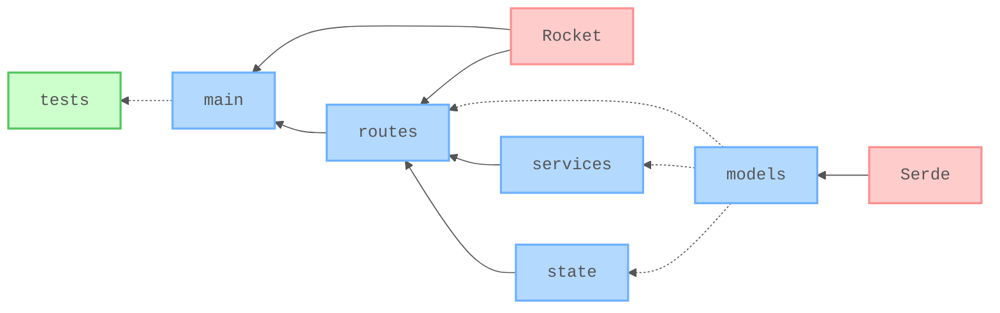

# 🧪 RESTful API with Rust and Rocket

[](https://github.com/nanotaboada/rust-samples-rocket-restful/actions/workflows/rust-ci.yml)
[](https://github.com/nanotaboada/rust-samples-rocket-restful/actions/workflows/rust-cd.yml)
[](https://opensource.org/licenses/MIT)


Proof of Concept for a RESTful Web Service built with **Rocket** and **Rust 2024 Edition**. This project demonstrates best practices for building a layered, testable, and maintainable API implementing CRUD operations for a Players resource (Argentina 2022 FIFA World Cup squad).

## Features

- 🏗️ **Layered Architecture** - Modular design with routes, services, state, and models as distinct packages
- 🔒 **Thread-Safe State** - SQLite access via Mutex-wrapped managed state using Rocket's `State<T>`
- ✅ **Type Safety** - Strong Rust type system with Serde for request/response serialization
- 🚦 **Comprehensive Testing** - Integration tests covering all endpoints with real SQLite
- 🐳 **Containerized Deployment** - Multi-stage Docker builds with pre-seeded database
- 🔄 **Automated Pipeline** - Continuous integration with cargo test, clippy, and GitHub releases

## Tech Stack

| Category | Technology |
| -------- | ---------- |
| **Language** | [Rust 2024 Edition](https://www.rust-lang.org/) |
| **Web Framework** | [Rocket 0.5.1](https://rocket.rs/) |
| **Serialization** | [Serde](https://serde.rs/) |
| **Unique IDs** | [uuid](https://github.com/uuid-rs/uuid) |
| **Database** | [SQLite](https://www.sqlite.org/) via [rusqlite](https://github.com/rusqlite/rusqlite) (bundled) |
| **Containerization** | [Docker](https://github.com/docker) & [Docker Compose](https://github.com/docker/compose) |

## Architecture

Layered architecture with Rocket's managed state for thread-safe dependency sharing.



> *Arrows follow the injection direction (A → B means A is injected into B). Solid = runtime dependency, dotted = structural. Blue = core domain, red = third-party, green = tests.*

## API Reference

| Method | Endpoint | Description | Status |
| ------ | -------- | ----------- | ------ |
| `GET` | `/players` | List all players | `200 OK` |
| `GET` | `/players/:id` | Get player by ID | `200 OK` |
| `GET` | `/players/squadnumber/:squadnumber` | Get player by squad number | `200 OK` |
| `POST` | `/players` | Create new player | `201 Created` |
| `PUT` | `/players/squadnumber/:squadnumber` | Update player by squad number | `200 OK` |
| `DELETE` | `/players/squadnumber/:squadnumber` | Remove player by squad number | `204 No Content` |
| `GET` | `/health` | Health check | `200 OK` |

Error codes: `404 Not Found` (player not found) · `409 Conflict` (duplicate squad number on `POST`)

Alternatively, use [`rest/players.rest`](rest/players.rest) with the [REST Client](https://marketplace.visualstudio.com/items?itemName=humao.rest-client) extension for VS Code, or the built-in HTTP Client in JetBrains IDEs.

## Prerequisites

Before you begin, ensure you have the following installed:

- **Rust 2024 Edition or higher** (managed via `rust-toolchain.toml`)
- **Cargo** (comes with Rust)
- **Docker & Docker Compose** (optional, for containerized deployment)

## Quick Start

### Clone

```bash
git clone https://github.com/nanotaboada/rust-samples-rocket-restful.git
cd rust-samples-rocket-restful
```

### Build

```bash
cargo build
```

### Run

```bash
cargo run
```

### Access

Once the application is running, you can access:

- **API Server**: `http://localhost:9000`
- **Health Check**: `http://localhost:9000/health`

## Containers

### Build and Start

```bash
docker compose up
```

> 💡 **Note:** On first run, the container copies a pre-seeded SQLite database into a persistent volume. On subsequent runs, that volume is reused and the data is preserved.

### Stop

```bash
docker compose down
```

### Reset Database

To remove the volume and reinitialize the database from the built-in seed file:

```bash
docker compose down -v
```

### Pull Docker Images

Each release publishes multiple tags for flexibility:

```bash
# By semantic version (recommended for production)
docker pull ghcr.io/nanotaboada/rust-samples-rocket-restful:1.0.0

# By nominee name (memorable alternative)
docker pull ghcr.io/nanotaboada/rust-samples-rocket-restful:benzema

# Latest release
docker pull ghcr.io/nanotaboada/rust-samples-rocket-restful:latest
```

## Environment Variables

```bash
# Database storage path (default: ./storage/players-sqlite3.db)
STORAGE_PATH=./storage/players-sqlite3.db

# Rocket profile: debug or release (default: debug)
ROCKET_PROFILE=release
```

## Contributing

Contributions are welcome! Please see [CONTRIBUTING.md](CONTRIBUTING.md) for details on:

- Code of Conduct
- Development workflow and best practices
- Commit message conventions (Conventional Commits)
- Pull request process and requirements

**Key guidelines:**

- Follow [Conventional Commits](https://www.conventionalcommits.org/) for commit messages
- Run `cargo fmt` and `cargo clippy` before committing
- Ensure all tests pass (`cargo test`)
- Keep changes small and focused
- Review `.github/copilot-instructions.md` for architectural patterns

**Testing:**

Run the test suite with Rust's built-in test framework:

```bash
# Run all tests
cargo test

# Run tests with output
cargo test -- --nocapture
```

## Command Summary

| Command | Description |
| ------- | ----------- |
| `cargo run` | Start development server |
| `cargo build` | Build the application |
| `cargo build --release` | Build optimized release version |
| `cargo test` | Run all tests |
| `cargo fmt` | Format code |
| `cargo clippy` | Run linter |
| `cargo clean` | Clean build artifacts |
| `docker compose build` | Build Docker image |
| `docker compose up` | Start Docker container |
| `docker compose down` | Stop Docker container |
| `docker compose down -v` | Stop and remove Docker volume |
| **AI Commands** | |
| `/pre-commit` | Runs linting, tests, and quality checks before committing |

## Legal

This project is provided for educational and demonstration purposes and may be used in production at your own discretion. All trademarks, service marks, product names, company names, and logos referenced herein are the property of their respective owners and are used solely for identification or illustrative purposes.
